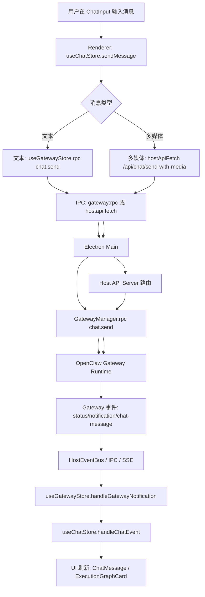
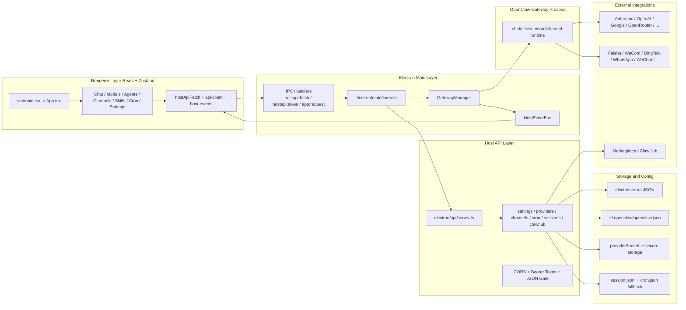

<!-- Generated: 2026-05-12 | Files scanned: 487 | Token estimate: ~780 -->

# 架构总览（ClawX）

## 系统形态
- 单仓库 Electron 桌面应用（非多包 monorepo）。
- 运行时由 4 层组成：
  1) Renderer（React + Vite）
  2) Electron Main
  3) Host API（本地 HTTP，127.0.0.1）
  4) OpenClaw Gateway（本地子进程，WS/HTTP）

## 高层架构图
```text
┌──────────────────────────────────────────────────────────────────┐
│                            User/UI                               │
└──────────────┬───────────────────────────────────────────────────┘
               │
               ▼
┌──────────────────────────────────────────────────────────────────┐
│ Renderer (React 19 + HashRouter + Zustand)                      │
│ src/main.tsx -> src/App.tsx -> pages/*                          │
│  - hostApiFetch() / subscribeHostEvent() / gateway:rpc          │
└──────────────┬───────────────────────────────────────────────────┘
               │ IPC (hostapi:fetch, hostapi:token, app:request)
               ▼
┌──────────────────────────────────────────────────────────────────┐
│ Electron Main                                                    │
│ electron/main/index.ts                                           │
│  - BrowserWindow / Tray / Menu / Lifecycle                      │
│  - registerIpcHandlers()                                         │
│  - startHostApiServer()                                          │
│  - GatewayManager lifecycle                                      │
└──────────────┬───────────────────────────────────────────────────┘
               │ local HTTP (/api/*)
               ▼
┌──────────────────────────────────────────────────────────────────┐
│ Host API Server (electron/api/server.ts)                         │
│  - CORS + Bearer token + JSON content-type gate                 │
│  - route modules (settings/providers/channels/cron/...)         │
│  - HostEventBus -> SSE (/api/events)                            │
└──────────────┬───────────────────────────────────────────────────┘
               │ RPC (ws/http)
               ▼
┌──────────────────────────────────────────────────────────────────┐
│ OpenClaw Gateway Process                                          │
│ electron/gateway/manager.ts                                      │
│  - chat/session/cron/channel runtime                              │
│  - dispatch events to main -> renderer                            │
└──────────────┬───────────────────────────────────────────────────┘
               │
               ▼
┌──────────────────────────────────────────────────────────────────┐
│ External Providers / Channel Plugins / Marketplace               │
│ Anthropic/OpenAI/Google/OpenRouter/...                           │
│ Feishu/WeCom/DingTalk/WhatsApp/WeChat plugins                    │
└──────────────────────────────────────────────────────────────────┘
```

## 关键边界
- UI 不直接访问 Gateway HTTP；统一走 `src/lib/host-api.ts` + `src/lib/api-client.ts`。
- Main 负责网络与进程控制（Gateway、更新、代理、OAuth、插件安装）。
- Host API 对外只暴露本机接口，并要求会话级 token。
- 数据持久化以文件/`electron-store` 为主，无关系型数据库。

## 核心流程图

### 1) Chat 请求主路径
```text
ChatInput -> useChatStore.sendMessage()
  -> text: useGatewayStore.rpc('chat.send', ...)
  -> media: hostApiFetch('/api/chat/send-with-media') [or IPC chat:sendWithMedia]
  -> Main GatewayManager.rpc('chat.send', ...)
  -> OpenClaw Gateway
  -> gateway events (status/notification/chat-message)
  -> HostEventBus / IPC
  -> useGatewayStore.handleGatewayNotification()
  -> useChatStore.handleChatEvent() -> UI render
```

### 2) 设置变更路径
```text
Settings Page -> useSettingsStore.setX()
  -> hostApiFetch('/api/settings/...', PUT)
  -> Host API route (settings.ts)
  -> utils/store.ts (electron-store)
  -> (if proxy/startup key) apply side-effects in main
```

### 3) Provider 账户路径
```text
Providers UI -> /api/provider-accounts
  -> handleProviderRoutes()
  -> ProviderService
  -> provider-store + secret-store + secure-storage
  -> provider-runtime-sync (sync to Gateway runtime)
```

## 关键入口文件
- `electron/main/index.ts`（652 行）
- `electron/api/server.ts`（135 行）
- `electron/main/ipc-handlers.ts`
- `src/main.tsx`
- `src/App.tsx`（213 行）

## Mermaid 图（可直接渲染）

### 1) 端到端流程图（Chat 主路径）


### 2) 系统架构图（分层与依赖）
